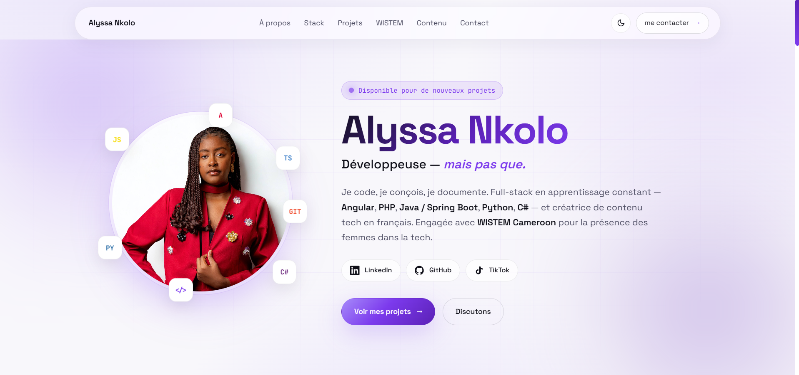

<div align="center">

# Portfolio — Alyssa Nkolo

Portfolio personnel présentant mes projets de développement, mon stack technique,
mon engagement avec **WISTEM Cameroon** et ma création de contenu tech.

**Développeuse — mais pas que.**

[](https://angular.dev)
[](https://www.typescriptlang.org)
[](https://sass-lang.com)
[](https://alyssa-portfolio-seven.vercel.app/)

### [Voir la démo en ligne →](https://alyssa-portfolio-seven.vercel.app/)

</div>

---

## Aperçu



---

## Fonctionnalités

-  **Splash screen animé** — effet machine à écrire à l'ouverture, faux terminal
-  **Mode clair / sombre** — bascule persistée, thème clair par défaut
-  **Design futuriste minimaliste** — accents violets, navbar en verre dépoli
-  **Responsive complet** — menu hamburger, drawer mobile animé
-  **Transitions morph au scroll** — reveal léger via `IntersectionObserver`
-  **Section engagement WISTEM** — description, galerie et liens communauté
-  **Section création de contenu** — TikTok, LinkedIn, Instagram, AI Hunters

---

## Stack technique

| Domaine | Technologies |
|---|---|
| **Framework** | Angular 21 (standalone components, signals, control flow) |
| **Langage** | TypeScript 5.9 |
| **Styles** | SCSS (design system avec variables CSS, light/dark) |
| **Routing** | Angular Router (lazy loading) |
| **Animation** | CSS transitions + `IntersectionObserver` (directive `[appReveal]`) |
| **Fonts** | Space Grotesk · JetBrains Mono (Google Fonts) |
| **Déploiement** | Vercel |

---

## Lancer le projet en local

### Prérequis

- **Node.js** ≥ 20
- **npm** ≥ 10
- **Angular CLI** (optionnel — les scripts npm suffisent)

### Installation

```bash
git clone https://github.com/Aly-leo/alyssa-portfolio.git
cd alyssa-portfolio
npm install
```

### Démarrer le serveur de développement

```bash
npm start
```

Puis ouvre [http://localhost:4200](http://localhost:4200) dans ton navigateur.
Le rechargement à chaud est actif : chaque modification de code se répercute
immédiatement à l'écran.

### Construire pour la production

```bash
npm run build
```

Les artefacts optimisés sont générés dans `dist/portfolio/browser/`.

### Prévisualiser un build de production en local

```bash
npm run build && npx http-server dist/portfolio/browser -p 8080 -c-1
```

---

##  Structure du projet

```
src/
├── app/
│   ├── data/
│   │   └── projects.ts          # Projets, stack, socials, WISTEM
│   ├── pages/
│   │   ├── welcome/             # Splash screen (typing effect)
│   │   └── home/                # Portfolio principal
│   ├── services/
│   │   └── theme.service.ts     # Gestion light / dark
│   ├── shared/
│   │   ├── social-icon.ts       # Composant icônes SVG
│   │   └── reveal.directive.ts  # Reveal au scroll
│   ├── app.routes.ts
│   └── app.ts
├── styles.scss                  # Design system global (variables + thèmes)
└── index.html
public/
└── img/                         # Photos (hero, projets, WISTEM)
```

---

## Personnaliser

Toutes les données affichées (projets, liens, socials, WISTEM…) sont
centralisées dans **[`src/app/data/projects.ts`](src/app/data/projects.ts)**.

---

## Contact

- **Email** — [zamoalyssa@gmail.com](mailto:zamoalyssa@gmail.com)
- **LinkedIn** — [Zamo Alyssa](https://www.linkedin.com/in/zamo-alyssa)
- **GitHub** — [@Aly-leo](https://github.com/Aly-leo)
- **TikTok** — [@alyssankolo](https://www.tiktok.com/@alyssankolo)

---

<div align="center">

Fait par **Alyssa Nkolo** — Douala, Cameroun 

</div>
